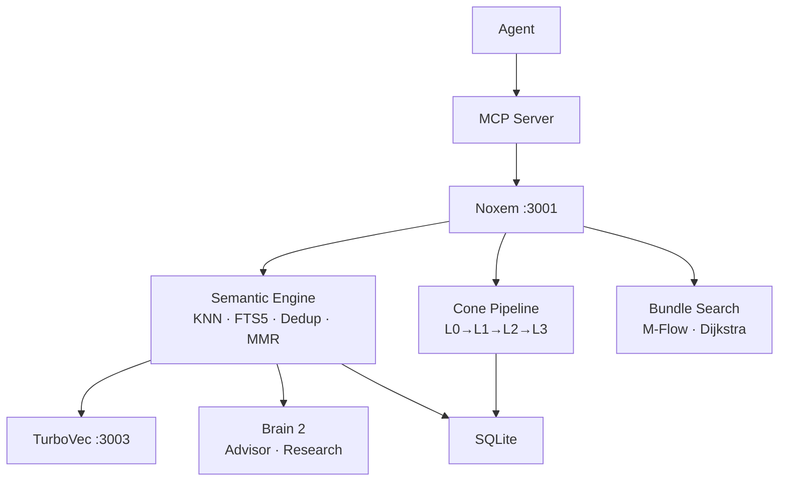
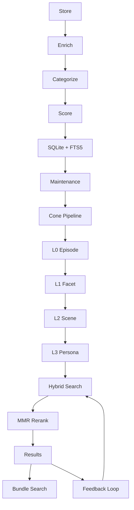

<div align="center">

<a href="https://freeimage.host/"></a>

### Noxem

Hierarchical memory for AI coding agents. Sub-25ms search, auto-dedup, cone extraction.

[](https://opensource.org/licenses/MIT)
[](https://nodejs.org/)
[](https://python.org/)
[](https://github.com/RyanCodrai/turbovec)
[]()

[Quick Start](#-quick-start) · [How It Works](#-how-it-works) · [How to Use](#-how-to-use) · [Modes](#-modes) · [Benchmarks](#-benchmarks)

</div>

---

## Quick Start

**Requirements:** Node.js 22+, Python 3.10+

```bash
git clone https://github.com/LVT382009/noxem.git
cd noxem
bash install.sh
hermes-noxem
```

First run downloads Brain 1 (~300 MB). Pick a mode and go.

---

## How It Works

Two brains, one memory:

| | Brain 1 — Semantic | Brain 2 — Reasoning |
|:--|:--|:--|
| **Does** | Vector KNN + FTS5 search, dedup, categorize, decay | Drift detection, session extraction, web research |
| **Speed** | ~25 ms | Background |
| **Offline** | Fully | Cloud or local LLM |

Memories flow through a **4-layer cone**: episode → facet → scene → persona. TurboVec provides 8x compressed vector search; sqlite-vec is the automatic fallback.

### Architecture



### Memory Lifecycle



---

## How to Use

### CLI

```bash
hermes-noxem                    # Interactive selection
hermes-noxem --cloud-brain2     # Cloud Brain 2
hermes-noxem --local            # Local Brain 2
hermes-noxem --no-brain2        # Memory-only
hermes-noxem --resume <id>      # Continue a session

hermes noxem status             # Health + stats
hermes noxem search <query>     # Search memories
hermes noxem run                # Run maintenance
hermes noxem config             # Show config
hermes memory setup             # Setup wizard
```

### MCP Tools

| Tool | Description |
|:-----|:------------|
| `memory_search` | Hybrid, vector, or keyword search |
| `memory_store` | Store with auto-categorization |
| `memory_sync` | Sync external context |
| `memory_release` | Release a memory |
| `memory_supersede` | Mark memory superseded |
| `advisor_advice` | Drift-aware advice from Brain 2 |
| `search_web` | Web search via DuckDuckGo |
| `memory_graph_traverse` | Traverse memory graph |
| `memory_bundle_search` | M-Flow multi-layer retrieval |
| `memory_learn` | Extract procedures from session |

### Brain 2 as OpenAI API

```bash
curl http://127.0.0.1:8000/v1/chat/completions \
  -H "Content-Type: application/json" \
  -d '{"model":"default","messages":[{"role":"user","content":"Hello"}]}'
```

Drop-in OpenAI base URL — streaming and non-streaming supported.

### Local LLM Setup

Choose **Local model** during setup:

| Provider | Default URL | Notes |
|:---------|:------------|:------|
| **Ollama** | `http://localhost:11434/v1` | Auto-detects models |
| **LM Studio** | `http://localhost:1234/v1` | Start server first |
| **llama.cpp** | `http://127.0.0.1:8080/v1` | Use `--jinja` flag |
| **Any OpenAI-compatible** | Your URL | Needs `/v1/chat/completions` |

---

## Modes

| Mode | What's enabled | Best for | RAM |
|:-----|:---------------|:---------|:----|
| **Brain 1 only** | KNN + FTS5 + dedup + categorize | Low RAM, fast lookups | ~300 MB |
| **Brain 1 + Cloud** | Everything + advisor + web research | Full sessions | ~300 MB |
| **Brain 1 + Local** | Everything + local LLM + DDG | Fully offline | ~1-4 GB |

---

## Benchmarks

| Operation | Latency | Notes |
|:----------|:--------|:------|
| Store | ~23 ms | Auto-categorize + FTS5 |
| Search (hybrid) | ~25 ms | KNN + FTS5 via RRF |
| Batch store (50) | ~0.6 ms each | Single transaction |
| Maintenance | ~18 ms | Dedup + consolidate |

---

## Configuration

| Variable | Default | Description |
|:---------|:--------|:------------|
| `MEMORY_PORT` | `3001` | Server port |
| `VECTOR_BACKEND` | `hybrid` | `hybrid`, `turbovec`, or `sqlite` |
| `TURBOVEC_URL` | `http://127.0.0.1:3003` | TurboVec sidecar |
| `DUP_THRESHOLD` | `0.92` | Dedup sensitivity |
| `BUNDLE_TOP_K` | `5` | Top-K per cone layer |
| `BRAIN2_PROVIDER` | `cloud` | `cloud` or `local` |
| `PIPELINE_ENABLED` | `true` | Cone extraction pipeline |
| `MEMORY_DECAY_HALF_LIFE` | `30` | Recency decay (days) |

<details>
<summary>Full env variable list</summary>

| Variable | Default | Description |
|:---------|:--------|:------------|
| `ENABLE_EMBEDDING` | `true` | Brain 1 semantic engine |
| `ENABLE_ADVISOR` | `true` | Brain 2 advisor |
| `ENABLE_MAINTENANCE` | `true` | Auto-cleanup every 5 min |
| `ENABLE_RESEARCH` | `true` | Background web research |
| `RLM_ENABLED` | `true` | RLM Python sidecar |
| `EMBEDDING_DIM` | `256` | Vector dimension |
| `EMBEDDING_DTYPE` | `q8` | Precision (fp32/q8/q4) |
| `NOXEM_PYTHON` | auto (venv) | Python binary for sidecars |
| `NOXEM_CONTEXT_WINDOW` | `8192` | LLM context window (tokens) |
| `LLM_URL` | `http://127.0.0.1:8000/v1/chat/completions` | LLM endpoint |
| `LLM_MODEL` | _(provider default)_ | Model for Brain 2 |
| `LLM_API_KEY` | _(empty)_ | API key (optional) |
| `LLM_TIMEOUT` | `120000` | Brain 2 timeout (ms) |
| `LOCAL_LLM_URL` | _(empty)_ | Local LLM base URL |
| `MEMORY_MAX_RESULTS` | `5` | Search result limit |
| `MEMORY_MAX_TOKENS` | `2000` | Context injection budget |
| `MEMORY_API_KEY` | _(empty)_ | API auth token |
| `CORS_ORIGIN` | `http://localhost:*` | CORS origins |
| `LOG_LEVEL` | `info` | Verbosity |
| `CONTRADICT_THRESHOLD` | `0.80` | Contradiction threshold |
| `QUERY_CACHE_TTL_MIN` | `120` | Cache TTL (min) |
| `RLM_MAX_SUB_CALLS` | `5` | RLM sub-calls per request |
| `RLM_TIMEOUT_MS` | `120000` | RLM timeout (ms) |
| `RATE_LIMIT_MAX` | `120` | Requests/min per IP |
| `AUTO_PURGE_DAYS` | `365` | Low-importance purge age |

</details>

---

## Contributing

1. Fork → 2. Branch → 3. Commit → 4. Push → 5. PR

MIT © [LVT382009](https://github.com/LVT382009)
