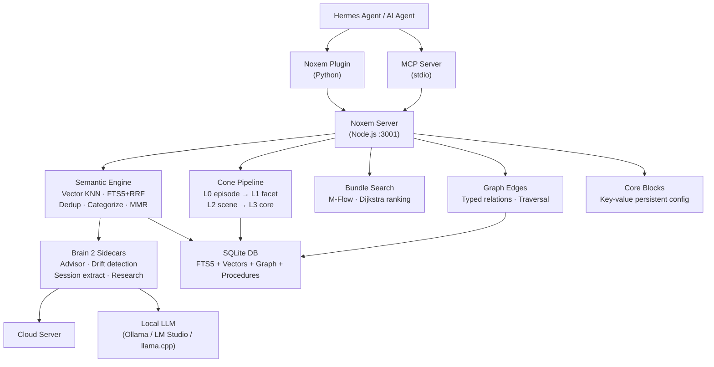
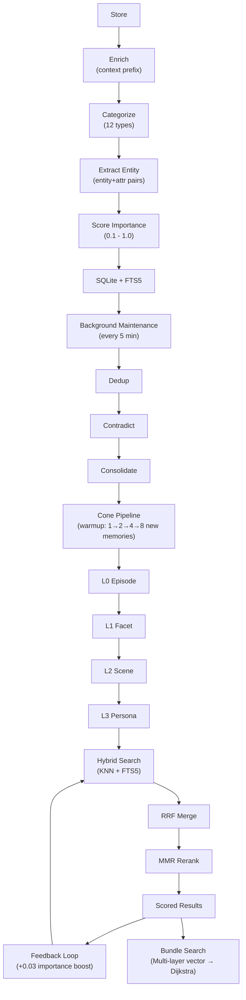

<div align="center">

<a href="https://freeimage.host/"></a>

[](https://opensource.org/licenses/MIT)
[](https://nodejs.org/)
[](https://python.org/)
[](https://sqlite.org/)
[]()
[]()

---

[Features](#-features) · [Quick Start](#-quick-start) · [Architecture](#-architecture) · [Config](#-configuration) · [Benchmarks](#-benchmarks) · [Tools](#-available-tools) · [Contributing](#-contributing)

</div>

---

## Features

<table>
<tr>
<td width="50%">

### :brain: Brain 1 — Semantic Engine

| | |
|---|---|
| **Hybrid Search** | Vector KNN + FTS5 keyword, merged via Reciprocal Rank Fusion |
| **Cone Pipeline** | L0-L3 progressive extraction: episode → facet → scene → persona |
| **Bundle Search** | M-Flow multi-layer retrieval with Dijkstra shortest-path ranking |
| **Graph Edges** | Typed relationships between memories with traversal |
| **Core Blocks** | Key-value persistent config blocks |
| **MCP Server** | 8 tools via stdio JSON-RPC for AI agent integration |
| **Auto-Categorization** | Tags: preference, project, profile, goal, entity, event, fact... |
| **Smart Dedup** | Cosine >0.92 → merge automatically |
| **Conflict Resolution** | Entity-attribute matching → older superseded |
| **Contextual Enrichment** | Context prefix before indexing — ~49% better retrieval |
| **Weibull Decay** | Profiles never decay, requests expire in 3 days |
| **Spaced Repetition** | Recalled memories stay relevant longer |
| **Adaptive Search** | Classifies query intent, weights vector vs keyword |
| **MMR Diversity** | No near-identical results in search |
| **Provenance Graph** | Full lineage tracking through supersession history |

</td>
<td width="50%">

### :rocket: Brain 2 — Reasoning Engine

| | |
|---|---|
| **Cloud or Local** | Cloud Brain 2 (free account) **or** any local OpenAI-compatible LLM |
| **Ollama / LM Studio / llama.cpp** | Drop-in — just enter your base URL + model name |
| **Drift Detection** | Warns when conversation goes off-goal |
| **Context Recovery** | Preserves critical info across compaction |
| **Session Extraction** | Stores key memories when session ends |
| **Background Research** | Detects topics → DDG search → extract facts → store |
| **Multi-Query Expansion** | Generates alternate phrasings for vague searches |
| **Consolidation** | Clusters low-importance → single high-importance summary |
| **Category Auto-Correction** | Catches and fixes misclassified memories |
| **Search Feedback Loop** | Boost importance for memories that influenced responses |
| **Bi-Temporal Tracking** | `valid_from` / `valid_until` timestamps |
| **Procedure Learning** | Extract reusable workflows from session history |
| **Coreference Resolution** | Pronoun → antecedent matching with gender filtering |
| **Crawl Mode Research** | Deep domain research with page crawling |
| **TurboVec Sidecar** | FastAPI + numpy high-perf vector KNN |
| **RLM Bridge** | Recursive LLM decomposition via Python sidecar |
| **Research Hints** | Compact summaries injected — no fact dump |

</td>
</tr>
</table>

> [!TIP]
> Run `hermes-noxem` to start. Choose **Brain 1 only** (fast, low RAM) or **Brain 1 + Brain 2**. Brain 2 supports cloud or local — local mode is fully offline.

---

## Quick Start

**Requirements:** Node.js 22+, Python 3.10+, Hermes Agent v2026+

### Linux / WSL

```bash
git clone https://github.com/LVT382009/noxem.git
cd noxem
bash install.sh
```

### macOS

```bash
xcode-select --install
/bin/bash -c "$(curl -fsSL https://raw.githubusercontent.com/Homebrew/install/HEAD/install.sh)"
brew install node
git clone https://github.com/LVT382009/noxem.git
cd noxem
bash install.sh
```

> [!NOTE]
> First run downloads Brain 1 (~300 MB).

---

## How to Use

```bash
hermes-noxem                   # Launch with interactive selection
hermes-noxem --cloud-brain2    # Launch with cloud Brain 2 (no prompt)
hermes-noxem --local           # Launch with local Brain 2 (no prompt)
hermes-noxem --no-brain2       # Launch memory-only (no prompt)
hermes-noxem --resume <id>     # Continue a session with Noxem
```

| Mode | Enabled | Best for |
|:-----|:--------|:---------|
| **Brain 1 only** | Semantic search, dedup, categorization, FTS5 | Low RAM, quick lookups |
| **Brain 1 + Cloud** | Everything + cloud advisor + web research | Full sessions, web research |
| **Brain 1 + Local** | Everything + local LLM advisor + DDG research | Fully offline, privacy-first |

When you select Brain 2, you'll be asked to choose a provider:

```
Brain 2 — Provider Selection

[1] Cloud — free via cloud account
[2] Local model — any OpenAI-compatible LLM (Ollama, LM Studio, llama.cpp...)
[3] Skip Brain 2
```

If you choose **Local model**, you'll be prompted for:

| Setting | Description | Example |
|:--------|:------------|:--------|
| **Base URL** | Your LLM server's OpenAI-compatible endpoint | `http://localhost:11434/v1` (Ollama) |
| **Model name** | The model identifier your server expects | `gemma4:e4b`, `llama3.1` |
| **API key** | Optional — not needed for Ollama or llama.cpp | Leave empty to skip |
| **Context window** | Token limit for the model | `8192`, `32768`, `131072`, `1048576` |

### Supported Local Providers

| Provider | Default Base URL | Notes |
|:---------|:-----------------|:------|
| **Ollama** | `http://localhost:11434/v1` | Auto-detects installed models |
| **LM Studio** | `http://localhost:1234/v1` | Start local server first |
| **llama.cpp** | `http://127.0.0.1:8080/v1` | Use `--jinja` flag for reasoning support |
| **Any OpenAI-compatible** | Your URL | Must support `/v1/chat/completions` |

> [!NOTE]
> When using a local model, web research falls back to **DuckDuckGo search** instead of cloud search. This works fully offline.

### CLI Commands

```bash
hermes noxem status           # Server health + memory stats
hermes noxem search <query>   # Search stored memories
hermes noxem run              # Run maintenance manually
hermes noxem config           # Show current configuration
```

### Using Brain 2 as an OpenAI API

Brain 2 exposes a full OpenAI-compatible API on port 8000. Use it with any tool:

```bash
# Example with curl
curl http://127.0.0.1:8000/v1/chat/completions \
  -H "Content-Type: application/json" \
  -d '{"model":"default","messages":[{"role":"user","content":"Hello"}]}'
```

Both streaming and non-streaming are supported — it works as a drop-in OpenAI base URL.

### Configuring via `hermes memory setup`

Settings can also be configured through the Hermes setup wizard:

```bash
hermes memory setup
```

This saves your configuration to `~/.hermes/noxem.json`, which the launcher reads on startup. Available settings:

| Key | Description | Default |
|:----|:------------|:--------|
| `memory_server` | Memory server URL | `http://127.0.0.1:3001` |
| `brain2_provider` | `cloud` or `local` | `cloud` |
| `llm_url` | LLM API endpoint | `http://127.0.0.1:8000/v1/chat/completions` |
| `llm_model` | Model name for LLM calls | _(provider default)_ |
| `llm_api_key` | API key (optional) | _(empty)_ |
| `context_window` | LLM context window size (tokens) | `8192` |
| `embedding_enabled` | Enable Brain-1 vector search | `true` |

---

## Architecture



---

## Memory Lifecycle



---

## Available Tools

| Tool | Description |
|:-----|:------------|
| `memory_search` | Search with method: hybrid, vector, or keyword |
| `memory_store` | Store a fact with auto-categorization |
| `memory_sync` | Sync external context into memory |
| `memory_release` | Release (deactivate) a memory |
| `memory_supersede` | Mark old memory as superseded by newer one |
| `memory_lineage` | Trace provenance chain through supersession history |
| `memory_contradiction_check` | Find contradicting memories (same entity+attribute) |
| `memory_feedback` | Report which memory IDs influenced your response |
| `advisor_advice` | Get drift-aware advice from Brain 2 |
| `search_web` | Search the web via DuckDuckGo |
| `research_hints` | Get research status and hints |
| `memory_graph_traverse` | Traverse memory graph edges |
| `memory_learn` | Extract procedures from session |
| `memory_bundle_search` | M-Flow multi-layer retrieval |

---

## Configuration

| Variable | Default | Description |
|:---------|:--------|:------------|
| `MEMORY_PORT` | `3001` | Server port |
| `MEMORY_DB_DIR` | `./data` | Database directory |
| `DUP_THRESHOLD` | `0.92` | Deduplication sensitivity |
| `CONTRADICT_THRESHOLD` | `0.80` | Contradiction detection threshold |
| `ENABLE_MAINTENANCE` | `true` | Auto-cleanup every 5 minutes |
| `PIPELINE_ENABLED` | `true` | Enable cone extraction pipeline |
| `RLM_ENABLED` | `true` | Enable RLM Python sidecar bridge |
| `NOXEM_CONTEXT_WINDOW` | `8192` | LLM context window size (tokens) — affects per-turn content limits |
| `VECTOR_BACKEND` | `sqlite-vec` | Vector backend: `sqlite-vec` or `turbovec` |
| `TURBOVEC_URL` | `http://127.0.0.1:8100` | TurboVec sidecar URL |
| `NOXEM_PYTHON` | auto (venv preferred) | Python binary for sidecars |
| `BUNDLE_TOP_K` | `5` | Top-K hits per cone layer in bundle search |
| `BUNDLE_MIN_SCORE` | `0.15` | Minimum similarity for bundle search |
| `ENABLE_RESEARCH` | `true` | Background web research pipeline |
| `RESEARCH_MIN_INTERVAL` | `30000` | Min ms between research per session |
| `MEMORY_DECAY_HALF_LIFE` | `30` | Default recency decay (days) |
| `MEMORY_MAX_TOKENS` | `2000` | Token budget for context injection |
| `RATE_LIMIT_MAX` | `120` | Max requests per minute per IP |
| `AUTO_PURGE_DAYS` | `365` | Days before low-importance memories are purged |
| `BRAIN2_PROVIDER` | `cloud` | Brain 2 mode: `cloud` or `local` |
| `LOCAL_LLM_URL` | _(empty)_ | Local LLM base URL (e.g. `http://localhost:11434/v1`) |
| `LLM_MODEL` | _(provider default)_ | Model for Brain 2 calls |
| `LLM_API_KEY` | _(empty)_ | API key for local LLM (optional) |
| `LLM_TIMEOUT` | `120000` | Brain 2 request timeout (ms) |

<details>
<summary>Full env variable list</summary>

| Variable | Default | Description |
|:---------|:--------|:------------|
| `ENABLE_EMBEDDING` | `true` | Enable Brain 1 semantic engine |
| `ENABLE_ADVISOR` | `true` | Enable Brain 2 advisor |
| `EMBEDDING_MODEL` | `default` | Brain 1 engine identifier |
| `EMBEDDING_DTYPE` | `q8` | Engine precision (fp32/q8/q4) |
| `EMBEDDING_DIM` | `256` | Brain 1 vector dimension |
| `EMBEDDING_LOAD_RETRIES` | `2` | Brain 1 engine retry count |
| `EMBEDDING_LOAD_TIMEOUT` | `300000` | Brain 1 engine load timeout (ms) |
| `EMBEDDING_CLEAR_CACHE_ON_RETRY` | `false` | Clear engine cache on retry |
| `LLM_URL` / `GEMMA_URL` | `http://127.0.0.1:8000/v1/chat/completions` | LLM API endpoint |
| `LLM_PORT` / `GEMMA4_PORT` | `8000` | Adapter listening port |
| `MEMORY_MAX_RESULTS` | `5` | Default search result limit |
| `MEMORY_API_KEY` | _(empty)_ | Bearer token for API auth |
| `CORS_ORIGIN` | `http://localhost:*` | CORS allowed origins |
| `LOG_LEVEL` | `info` | Log verbosity (`silent` to suppress) |
| `HF_FETCH_TIMEOUT` | `180000` | Component download timeout (ms) |
| `HF_FETCH_RETRIES` | `3` | Retry count for failed component downloads |
| `RLM_MAX_SUB_CALLS` | `5` | Max RLM sub-calls per request |
| `RLM_MAX_TOKENS` | `4096` | Max token budget per RLM request |
| `RLM_TIMEOUT_MS` | `45000` | RLM request timeout (ms) |

</details>

---

## Benchmarks

Tested on WSL2 Ubuntu, Node.js 22. Run your own: `cd server && bash benchmark.sh`

| Operation | Latency | Notes |
|:----------|:--------|:------|
| Store (single) | ~23 ms | Auto-categorization + entity extraction + FTS5 |
| Store (batch 50) | ~0.6 ms each | Bulk insert, single transaction |
| Search (hybrid) | ~25 ms | Vector KNN + FTS5 via RRF |
| Search (FTS) | ~26 ms | Full-text with Weibull scoring |
| Sync turn | ~20 ms | Store user + assistant messages |
| Maintenance cycle | ~18 ms | Dedup + contradiction + consolidation + archive |

> [!NOTE]
> With Brain 1 enabled, hybrid search adds ~5-10 ms for vector KNN lookup. Brain 1 loads in the background without blocking server startup.

---

## Contributing

1. Fork the repo
2. Create a feature branch (`git checkout -b feature/my-feature`)
3. Commit your changes (`git commit -m 'Add my feature'`)
4. Push to the branch (`git push origin feature/my-feature`)
5. Open a Pull Request

---

<div align="center">

## License

MIT © [LVT382009](https://github.com/LVT382009)

</div>
