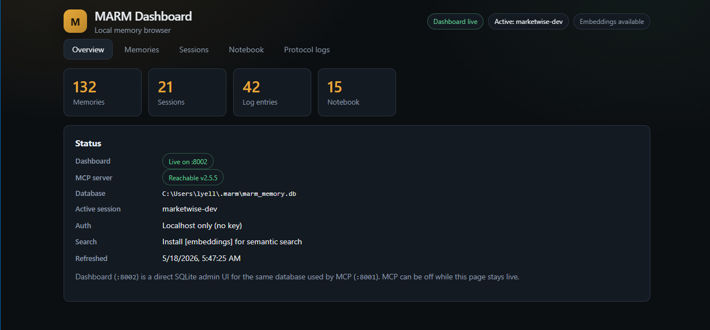

# MARM Dashboard

Local web UI for browsing and editing MARM memory. **Separate from `marm-mcp-server`** — reads and edits the same SQLite database (`~/.marm/marm_memory.db`) while MCP keeps running on port **8001**.

## Why use it

MCP tools are built for agents (search, log, recall). This dashboard is for **you**: list memories, delete stale entries, inspect sessions and protocol logs, edit notebook keys.



## Quick start

```powershell
cd marm-dashboard
pip install -e .
python -m marm_dashboard --open
```

Open **http://127.0.0.1:8002/** (default). Use `--open` to launch your system browser.

### With MCP server

Terminal 1:

```powershell
cd marm-mcp-server
python -m marm_mcp_server
```

Terminal 2:

```powershell
cd marm-dashboard
python -m marm_dashboard --open
```

---

## Linux Quick Start

### **Option 1: pip install** ⭐ **(Recommended - Fastest)**

```bash
cd marm-dashboard
pip install -e .
python -m marm_dashboard --open
```

### **Option 2: pip install in virtualenv** ⚡ **(Clean environment)**

```bash
python -m venv marm-env
source marm-env/bin/activate
pip install -e .
python -m marm_dashboard
```

Both can run at once (SQLite WAL). The dashboard is a direct SQLite admin UI: edits made here bypass MCP tool events, but use the same tables and sanitization rules.

The status panel also checks the MCP server on `127.0.0.1:8001` every 15 seconds. When HTTP mode is running, it shows reachability, version, status, latency, and last checked time. If MCP is running through STDIO, the panel may show `Not on :8001`; that is expected because STDIO has no HTTP health endpoint.

## Authentication (same rule as MCP)

| Situation | Dashboard behavior |
|-----------|-------------------|
| **No `MARM_API_KEY`** | Local-only: requests must come from `127.0.0.1` / `::1` (same idea as MCP). |
| **`MARM_API_KEY` set** (env or `~/.marm/.env`) | All `/api/*` routes need `Authorization: Bearer <key>`. Browser shows an unlock screen; key is kept in memory only until the page reloads. |

Docker/local process: use the **same** `MARM_API_KEY` as the MCP server. The dashboard reads `~/.marm/.env` when the env var is not set.

```powershell
$env:MARM_API_KEY = "your-key-from-docker-or-env-file"
python -m marm_dashboard
```

## Docker

Build:

```powershell
docker build -t marm-dashboard:local .
```

Run with the same database volume and key as MCP:

```powershell
$env:MARM_API_KEY = "your-marm-key"
docker run --rm -p 127.0.0.1:8002:8002 `
  -e MARM_API_KEY=$env:MARM_API_KEY `
  -v ${HOME}\.marm:/home/marm/.marm `
  marm-dashboard:local
```

The image binds to `0.0.0.0` inside the container so Docker port mapping works. Keep the host mapping on `127.0.0.1` unless you intentionally want another machine to reach the dashboard.

## Configuration

| Variable | Default | Purpose |
|----------|---------|---------|
| `MARM_API_KEY` | (from env, then `~/.marm/.env`) | Same key as `marm-mcp-server` |
| `MARM_DB_PATH` | `~/.marm/marm_memory.db` | Database file (same as MCP) |
| `MARM_DASHBOARD_HOST` | `127.0.0.1` | Bind address |
| `MARM_DASHBOARD_PORT` | `8002` | HTTP port |

Optional embeddings when adding memories (matches MCP semantic search):

```powershell
pip install -e ".[embeddings]"
```

## API (for scripts)

| Method | Path | Description |
|--------|------|-------------|
| GET | `/api/summary` | Counts and DB path |
| GET | `/api/mcp-status` | MCP server reachability probe with status, version, latency, and last checked data |
| GET | `/api/session-names` | All session names (sessions + memories + logs) |
| GET | `/api/sessions` | List sessions (`q`) |
| POST | `/api/sessions` | Create session |
| DELETE | `/api/sessions` | Delete all sessions |
| DELETE | `/api/sessions/{name}` | Delete single session |
| GET | `/api/memories` | List memories (`session`, `q`, `limit`, `offset`) |
| POST | `/api/memories` | Add memory |
| PUT | `/api/memories/{id}` | Update memory content and context type |
| DELETE | `/api/memories` | Delete all memories (optional `session` param) |
| DELETE | `/api/memories/{id}` | Delete single memory |
| GET | `/api/logs` | Protocol log entries (`session`, `q`, `limit`, `offset`) |
| DELETE | `/api/logs` | Delete all log entries |
| DELETE | `/api/logs/{id}` | Delete single log entry |
| GET | `/api/notebook` | Notebook entries (`q`) |
| POST | `/api/notebook` | Create/update entry |
| DELETE | `/api/notebook` | Delete all notebook entries |
| DELETE | `/api/notebook/{name}` | Delete single entry |

## Security note

HTTP auth (`MARM_API_KEY`) protects the dashboard API. Anyone with direct read/write access to `marm_memory.db` (volume mount, backup, copy) can still open the database outside this app. Treat the DB file like a secret in Docker.

The UI has no external CDN/font dependency, sends security headers, and keeps the unlock key in browser memory only. Refreshing the page requires unlocking again.

## License

MIT (same as MARM Systems)
