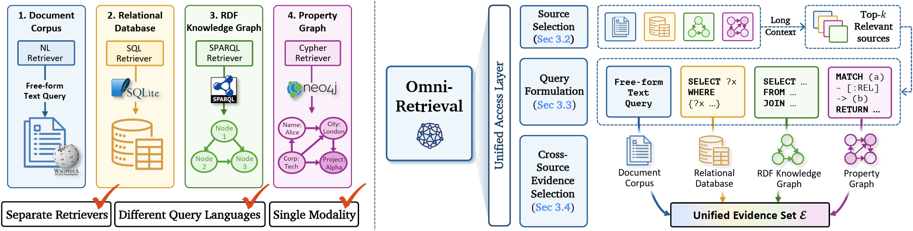

# OmniRetrieval

📄 Paper: Baek et al., [*OmniRetrieval: Unified Retrieval across Heterogeneous Knowledge Sources*](https://arxiv.org/abs/2605.29250) (arXiv:2605.29250)



OmniRetrieval takes a natural-language query, selects the relevant knowledge sources, formulates a query in the native language of each, executes them, and consolidates the results into a single evidence set.

The benchmark spans four backends over 13 datasets and 309 distinct knowledge bases:

- **Unstructured corpus** (free-form text) — BEIR: NFCorpus, SciFact, FiQA, MS MARCO, FEVER, NQ, HotpotQA
- **Relational database** (SQL) — Spider, BIRD
- **RDF knowledge graph** (SPARQL) — LC-QuAD 2.0, QALD-10, SimpleQuestions
- **Labeled property graph** (Cypher) — Text2Cypher (Neo4j Labs)

## Quickstart

Run the full pipeline on the built-in demo queries:

```bash
python main.py --demo
```

Or call it from Python:

```python
from dotenv import load_dotenv
load_dotenv()

from src.model.llm_client import LLMClient
from src.model.retrieval import RetrievalPipeline

pipeline = RetrievalPipeline(llm=LLMClient(provider="openai"), data_dir="data/processed")
question = "Which actors have acted in movies directed by the person who directed Speed Racer?"

sources = pipeline.route(question, top_k=3)                             # source selection
candidates = [pipeline.execute(pipeline.generate(s)) for s in sources]  # formulation + execution
best = candidates[pipeline.select(question, candidates)]                # evidence selection
print(best.answer)
```

Both need the data prepared first — see [Setup](#setup).

## Setup

Requires Python 3.10+.

```bash
pip install -r requirements.txt
```

Create a `.env` with whichever provider key(s) you use (the `vllm` provider runs locally and needs none):

```
OPENAI_API_KEY=sk-...
# ANTHROPIC_API_KEY=...
# GOOGLE_API_KEY=...
```

Download and preprocess the data (both scripts accept dataset names to limit the scope):

```bash
bash scripts/data/download_all.sh
bash scripts/data/preprocess_all.sh
python scripts/encode_corpora.py --corpora nfcorpus scifact fiqa   # optional: pre-encode corpora
```

SPARQL and Cypher evaluation compare against gold-query executions; cache them once to avoid re-hitting the endpoints:

```bash
python scripts/cache_sparql_answers.py
python scripts/cache_cypher_answers.py
```

## Usage

```bash
python main.py                                          # all datasets, default OpenAI backbone
python main.py --top-k-routes 3 --judge                 # 3 candidate sources + LLM-as-a-Judge
python main.py --provider vllm --model Qwen/Qwen3.5-4B  # local open-source backbone
```

Each run is saved to `runs/<timestamp>/` (gitignored) as `args.json`, `samples.jsonl`, `results.jsonl`, and `metrics.json`. Re-score a saved run without re-running it:

```bash
python evaluate.py --run-dir runs/20260528_120000 --judge
```

Backbones are set with `--provider` / `--model`:

| Provider    | Default model            |
|-------------|--------------------------|
| `openai`    | `gpt-5.4-mini`           |
| `anthropic` | `claude-haiku-4-5`       |
| `google`    | `gemini-3-flash-preview` |
| `vllm`      | `Qwen/Qwen3.5-4B`        |

## Evaluation

Metrics are macro-averaged across the four retrieval paradigms:

- **Source selection accuracy** — does a candidate match both the gold backend and knowledge base.
- **Query formulation** — exact match and token-level F1 against the gold query.
- **Retrieval accuracy** — NDCG@10 for Document Search; Execution Match for SQL/SPARQL/Cypher.
- **Evidence selection** — how often the selector commits to a gold-matching candidate.
- **LLM-as-a-Judge** (`--judge`) — answer-level correctness, tolerant of surface-form differences and of equivalent answers from an alternative source.

## Project structure

```
main.py        # run the pipeline (source selection → formulation → execution → evidence selection) + evaluate
evaluate.py    # re-score a saved run
src/
  data/        # UnifiedSample schema, dataset registry, per-backend source descriptors
  model/       # multi-provider LLM client; RetrievalPipeline (route / generate / execute / select)
  evaluation/  # source-selection, formulation, execution, selector, and judge metrics
  utils.py     # SQL / SPARQL / Cypher execution, run I/O
scripts/       # dataset download + preprocessing, corpus encoding, gold-answer caching
```

## Citation

If you find this work useful, please cite:

```bibtex
@misc{baek2026omniretrieval,
  title         = {OmniRetrieval: Unified Retrieval across Heterogeneous Knowledge Sources},
  author        = {Jinheon Baek and Soyeong Jeong and Sangwoo Park and Woongyeong Yeo and Minki Kang and Patara Trirat and Heejun Lee and Sung Ju Hwang},
  year          = {2026},
  eprint        = {2605.29250},
  archivePrefix = {arXiv},
  primaryClass  = {cs.CL},
  url           = {https://arxiv.org/abs/2605.29250}
}
```
